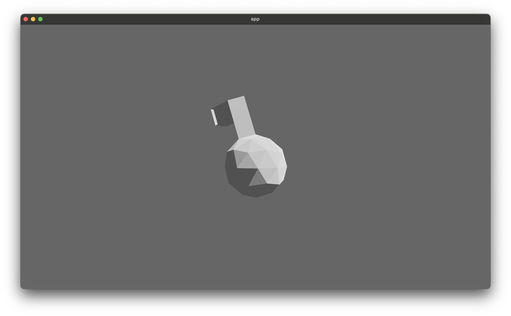

Testing a custom export from Blender to GLTF via the glb binary format.

Then ingesting that .glb into Bevy.

The shader is a cartoon-like shader, which can be compared against the FlightHelmet example (taken straight from the bevy github repo example).

